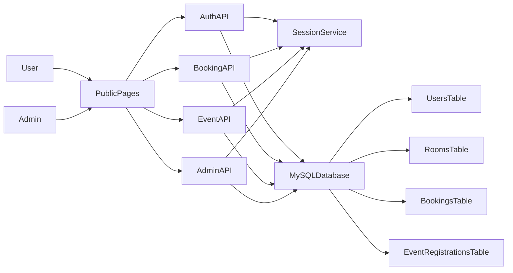
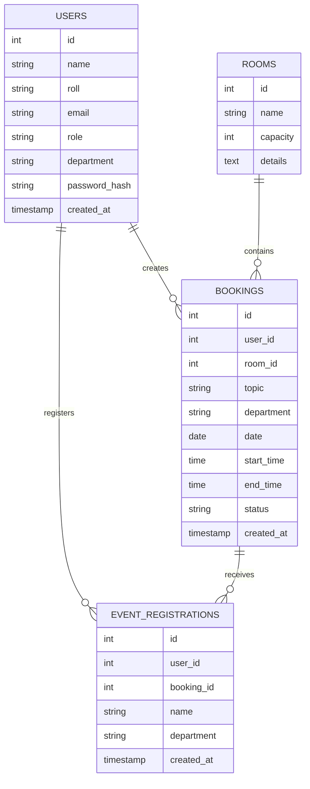
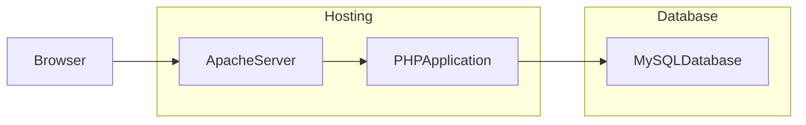

<p align="center">
  
</p>

---

## 🌐 Live Demo

### [Visit UTSHOB](http://127.0.0.1:5501/index.html)

> Replace the demo URL above with your actual hosted link after deployment.

For source code access, collaboration, or project inquiries, contact me through GitHub or email.

---

# 🧠 Platform Overview

**UTSHOB** is a premium event management and room booking platform designed for university events, community programs, seminars, cultural functions, sports activities, and departmental meetings.

The system allows users to:

* Discover upcoming events
* Register and log in securely
* Request a room or venue booking
* Select a venue, date, start time, and end time
* Track approved, pending, denied, and canceled bookings
* Register for approved events
* View personal registered events
* Let admins approve or deny booking requests
* Prevent approved room-booking time conflicts

The main goal of UTSHOB is to make event planning easier, more organized, and more transparent for students, professors, organizers, and administrators.

> **Host. Discover. Book. Celebrate.**

---

# ⚡ Core Features

## 🎉 Event Discovery

UTSHOB provides a modern homepage where users can explore upcoming events by category.

Supported event categories include:

* Technology
* Music
* Sports
* Culture
* University programs
* Community events

The homepage includes event cards, venue information, organizer highlights, search options, and a premium visual layout.

---

## 🏛 Smart Room Booking

Users can request a venue or room for a meeting or event.

The booking form collects:

* Event or meeting topic
* Department
* Date
* Start time
* End time
* Selected room or venue

Available default rooms include:

| Room | Capacity | Facilities |
|---|---:|---|
| Auditorium A | 400 | Projector, Stage |
| Seminar Hall B | 150 | Sound system |
| Conference Room C | 40 | Meeting table |

If the logged-in user is an admin, the booking can be approved directly. Normal users submit a pending request for admin approval.

---

## 🔐 Authentication System

UTSHOB includes a session-based authentication system using PHP and MySQL.

Supported actions:

| Action | Description |
|---|---|
| Register | Create a student or professor account |
| Login | Access the system with email and password |
| Logout | End the current session |
| Current user check | Detect whether a user is logged in |

Passwords are stored using PHP password hashing instead of plain text.

---

## 👥 User Roles

UTSHOB supports three user roles:

| Role | Permission |
|---|---|
| Student | Register, log in, request booking, register for approved events, view own events |
| Professor | Register, log in, request booking, register for approved events, view own events |
| Admin | Approve, deny, update, and cancel bookings |

Admin accounts are created manually in the database for better control.

---

## ✅ Admin Approval System

Admins can manage pending booking requests from the room schedule page.

Admin actions include:

* Approve pending booking
* Deny pending booking
* Update booking time
* Cancel booking
* Check all room schedules
* Filter schedules by room

Before approving a booking, the backend checks whether another approved booking already exists in the same room at the same time.

---

## 🚫 Conflict Prevention

UTSHOB prevents overlapping approved room bookings.

The system checks:

* Same room
* Same date
* Existing approved bookings
* Start and end time overlap

If there is a conflict, the booking approval or update is blocked.

---

## 📝 Event Registration

Users can register for approved events.

The system allows users to:

* View approved events
* Select an event
* Register with name and department
* Prevent duplicate registration for the same event
* View their registered events later

---

## 📅 Room Schedule Dashboard

The room schedule page displays booking records in a table format.

It shows:

* Room name
* Event topic
* Date
* Start time
* End time
* Status
* Requester name
* Available actions

Users can filter the schedule by room.

---

## 🎨 Premium Responsive UI

The interface is built with Bootstrap and custom CSS.

UI features include:

* Dark theme
* Glassmorphism-style cards
* Golden premium color accents
* Responsive layout
* Floating action buttons
* Toast notifications
* SweetAlert popups
* Bootstrap icons
* Mobile-friendly room cards

---

# 🧭 System Architecture



---

# 🏗 Technology Stack

## Frontend

* HTML5
* CSS3
* JavaScript
* Bootstrap 5
* Bootstrap Icons
* SweetAlert2
* Responsive web design

## Backend

* PHP
* PHP Sessions
* PDO
* REST-style API endpoints
* JSON responses
* Server-side validation

## Database

* MySQL
* UTF-8 database support
* Relational schema with foreign keys

## Local Development

* XAMPP / Apache
* phpMyAdmin
* MySQL server

---

# 📂 Project Structure

```text
utshob2
│
├── api
│   ├── admin.php
│   ├── auth.php
│   ├── bookings.php
│   ├── events.php
│   ├── session.php
│   │
│   └── config
│       └── db.php
│
├── public
│   ├── assets
│   │   ├── css
│   │   │   └── style.css
│   │   └── js
│   │       ├── app.js
│   │       └── meet.js
│   │
│   ├── index.php
│   ├── login.php
│   ├── register.php
│   ├── room.php
│   ├── events.php
│   ├── event-register.php
│   │
│   ├── bubu.jpg
│   ├── crowd.jpeg
│   ├── girls.webp
│   ├── icon.jpg
│   ├── ouou.jpg
│   ├── pohela.webp
│   └── thumbnail.png
│
├── sql
│   └── utshob.sql
│
└── README.md
```

---

# ⚙️ Installation

## 1. Clone the Repository

```bash
git clone https://github.com/yourusername/UTSHOB.git
cd UTSHOB
```

---

## 2. Move the Project to XAMPP

Copy the project folder into the XAMPP `htdocs` directory.

Example:

```text
C:\xampp\htdocs\utshob2
```

For Linux or macOS with a local Apache setup, place it inside the web server root directory.

---

## 3. Start Apache and MySQL

Open XAMPP Control Panel and start:

```text
Apache
MySQL
```

---

## 4. Create and Import the Database

Open phpMyAdmin:

```text
http://localhost/phpmyadmin
```

Then import:

```text
sql/utshob.sql
```

The SQL file creates:

* `utshob_db`
* `users`
* `rooms`
* `bookings`
* `event_registrations`

It also inserts the default room records.

---

## 5. Configure Database Connection

Open:

```text
api/config/db.php
```

Default XAMPP configuration:

```php
$dsn = "mysql:host=127.0.0.1;dbname=utshob_db;charset=utf8mb4";
$user = "root";
$pass = "";
```

If your MySQL username or password is different, update this file.

---

## 6. Create an Admin Account

Admin users are created manually.

Generate a bcrypt password hash using PHP:

```bash
php -r "echo password_hash('admin123', PASSWORD_BCRYPT);"
```

Then insert an admin user in phpMyAdmin or MySQL:

```sql
INSERT INTO users (name, email, role, department, password_hash)
VALUES ('Admin', 'admin@utshob.local', 'admin', 'CSE', 'PASTE_GENERATED_HASH_HERE');
```

Change the email and password before using it in a real deployment.

---

## 7. Run the Application

Open the project in your browser:

```text
http://localhost/utshob2/public/index.php
```

Useful local pages:

```text
http://localhost/utshob2/public/login.php
http://localhost/utshob2/public/register.php
http://localhost/utshob2/public/room.php
http://localhost/utshob2/public/events.php
http://localhost/utshob2/public/event-register.php
```

---

# 🔌 API Structure

## Authentication

```http
POST /api/auth.php?action=register
POST /api/auth.php?action=login
POST /api/auth.php?action=logout
GET  /api/auth.php?action=me
```

## Bookings

```http
GET  /api/bookings.php?action=list
GET  /api/bookings.php?action=list&room_id=1
POST /api/bookings.php?action=create
POST /api/bookings.php?action=update-time
POST /api/bookings.php?action=cancel
```

## Admin

```http
GET  /api/admin.php?action=pending
POST /api/admin.php?action=approve
POST /api/admin.php?action=deny
```

## Events

```http
GET  /api/events.php?action=approved-meets
GET  /api/events.php?action=my
POST /api/events.php?action=register
```

---

# 🗄 Database Overview

UTSHOB uses a MySQL relational database.

Main tables:

| Table | Purpose |
|---|---|
| users | Stores registered students, professors, and admins |
| rooms | Stores venue or room details |
| bookings | Stores room booking requests and statuses |
| event_registrations | Stores user registrations for approved events |



---

# 🔒 Security Features

UTSHOB includes several basic security practices:

* Password hashing using `password_hash()`
* Password verification using `password_verify()`
* PDO prepared statements
* Session-based authentication
* Admin-only route protection
* Role-based access checking
* Input validation for required fields
* Booking ownership checks before update or cancel
* Duplicate email prevention
* Duplicate event registration prevention
* Approved-booking conflict checking

Sensitive information should never be pushed to GitHub.

Recommended `.gitignore`:

```gitignore
.env
*.log
.DS_Store
.vscode/
.idea/
vendor/
node_modules/
```

---

# 🚀 Deployment Guide

UTSHOB is a PHP and MySQL project. It should be deployed on a hosting platform that supports PHP and MySQL.

Suitable deployment options:

* cPanel hosting
* Shared PHP hosting
* VPS with Apache/Nginx, PHP, and MySQL
* InfinityFree or similar PHP hosting for testing
* Render/Railway style server setup with PHP support, if configured manually

## Important Netlify Note

Netlify is mainly for static sites and frontend build output. It cannot run PHP backend files directly.

If this project is uploaded to Netlify, the static files may appear, but PHP APIs, sessions, login, database actions, and booking features will not work unless the backend is hosted separately on a PHP-supported server.

Recommended production structure:



---

# 🖼 Screenshots

Add screenshots from your project after pushing to GitHub.

Example image paths already available in the project:

```md


```

---

# 🏗 Correct Stack Summary

| Layer | Technology |
|---|---|
| Frontend markup | HTML5 |
| Styling | CSS3, Bootstrap 5 |
| Frontend logic | JavaScript |
| Alerts | SweetAlert2 |
| Icons | Bootstrap Icons |
| Backend | PHP |
| Database access | PDO |
| Database | MySQL |
| Local server | XAMPP / Apache |
| Authentication | PHP Sessions |
| API response format | JSON |

---

# 🌍 Supported Use Cases

UTSHOB can be used for:

* University event management
* Club and society programs
* Departmental seminars
* Cultural events
* Sports events
* Programming contests
* Conference room booking
* Auditorium booking
* Workshop scheduling
* Student-professor meeting requests

---

# 🚀 Future Vision

Planned improvements may include:

* QR-based event check-in
* Ticket generation
* Email notifications
* Admin dashboard analytics
* Event search connected to the database
* Online payment support
* Seat capacity tracking
* Calendar view
* PDF booking confirmation
* Organizer profiles
* Event image upload
* User profile dashboard
* Password reset system
* Environment-based database configuration
* Full mobile app version
* Multilingual interface with Bangla support

---

# ⚠️ Important Disclaimer

UTSHOB is an academic and project-based event management system.

Before using it in a real organization, improve and verify:

* Server security
* Database credentials
* Admin account creation flow
* CSRF protection
* Input sanitization
* Production error handling
* Email verification
* Backup strategy
* Deployment configuration

Do not use default local database credentials in production.

---

# 🤝 Contributing

Contributions are welcome.

To contribute:

```bash
git checkout -b feature/your-feature-name
git commit -m "Add your feature"
git push origin feature/your-feature-name
```

Then create a pull request.

Before submitting a contribution:

* Test registration and login
* Test room booking
* Test admin approval and denial
* Test duplicate event registration prevention
* Test room conflict handling
* Keep code readable and organized
* Do not commit database passwords

---

# 🐛 Reporting Issues

When reporting an issue, include:

* Issue description
* Steps to reproduce
* Expected result
* Actual result
* Browser name and version
* PHP version
* MySQL version
* Screenshot or screen recording, if available

For booking-related issues, also include:

* Room name
* Booking date
* Start time
* End time
* User role
* Booking status

---

# 📜 License

This project is licensed under the MIT License.

See the `LICENSE` file for more information.

---

# 👨‍💻 Author

Lija Moni

Frontend Developer
Crafting beautiful UI/UX

GitHub: @lija003

<p align="center">
  <strong>UTSHOB</strong>
  <br />
  Host. Discover. Book. Celebrate.
</p>


